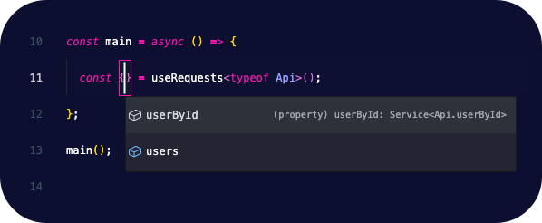
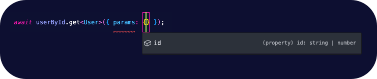

<div align="center">
	<br>
	<br>
	
	<br>
	<br>
	<br>
	<br>
</div>

**Support questions should be asked [here](https://github.com/frangeris/use-requests/discussions).**

## Install

> [!CAUTION]
> This package is still in development and not ready for production use.

```sh
npm install use-requests
```

abstracts

## Get started

This module provides a lightweight abstraction for making API requests in TypeScript, with a focus on defining and using REST API endpoints efficiently. The module offers a clean, type-safe way to handle HTTP requests using predefined endpoints.

Some key features:

- ✨ Type-safe API endpoint handling.
- ⚡️ Easy initialization with API base URL and endpoints.
- 🦾 Simplified request logic with _GET_, _POST_, and other HTTP methods via [fetch](https://developer.mozilla.org/en-US/docs/Web/API/Fetch_API/Using_Fetch) API.

## Usage

To begin using the API request module, you need to initialize it by specifying the base URL of your API and defining the endpoints you'll be working with. This setup ensures that all subsequent API requests are made to the correct URLs with consistent endpoint handling.

First, you’ll need to import the necessary functions.

- The `useRequests` function is the core hook for making requests.
- While `init` sets up the configuration for your API requests and can be called from anywhere in your app.

Here's how you import them from the module:

```ts
import { useRequests, init } from "use-requests";
```

Then, you'll define your API endpoints using an [enum](https://www.typescriptlang.org/docs/handbook/enums.html). This `enum` acts as a centralized way to declare all the routes your API supports. It also helps ensure that requests are type-safe, meaning you'll get compile-time checks for correct usage:

```ts
export enum Api {
  users = "/users",
  userById = "/users/:id",
}
```

Each key in the enum represents a different API route. These routes can contain dynamic parameters (e.g., `:id`), which are replaced by actual values when making requests.

Now, we need to initialize the by using the `init` function. This function requires two arguments:

- **Base URL**: The root URL where your API is hosted (e.g., https://api.example.io/dev).
- **Endpoints**: The enum you defined earlier, which specifies your available API routes.

```ts
init("https://api.example.io/dev", { ...Api });
```

- `https://api.example.io/dev` is the base URL of the API.
- The spread operator `{ ...Endpoints }` ensures that all the endpoints defined in the `Endpoints` enum are passed to the initialization function.

By setting up this initialization, you ensure that every request you make using the `useRequests` hook will automatically target the correct API with the predefined endpoints.

### ⚡️ Now, let's make some requests

Once the module is initialized, you can easily make requests to the defined endpoints. Here's a snippet for requests:

```ts
import { useRequests, init } from "use-requests";

type User = {};

export enum Api {
  users = "/users",
  userById = "/users/:id",
}

init("https://api.example.io/dev", { ...Api });

const main = async () => {
  const { userById, users } = useRequests<typeof Api>();
  const { data: usersRes } = await users.get<User[]>();
  const { data: userByIdRes } = await userById.get<User>({ params: { id: 1 } });
  // Optionally, set headers for the request
  // users.headers.set("Authorization", "Bearer token");
};
main();
```

The `data` property is a wrapper around the `Response.json()` method that looks for `data` key in the response, in case that property exists, it will be returned as the representation of the response `body.data` casted to the generic type used, eg: `User[]` or `User`.

The test endpoint is accessed with an id parameter. You can also set headers (like authorization tokens) as needed.

---

### Only registered endpoints are available



Based on the above example, the `useRequests` hook returns an object with methods for each endpoint defined in the `Api` enum. You can then call these methods to make requests to the corresponding API routes.

### Type-safe request handling



Each method returned by `useRequests` is type-safe, meaning that the parameters you pass to the method are checked against the expected types defined in `Api` at compile time. This ensures that you're using the correct parameters for each endpoint and helps prevent runtime errors.

> [!TIP]
> Only dynamic path parameters `:param` and query strings are currently supported. Support for request bodies will be added in future versions.

The response by any methods is an instance of [fetch Response](https://developer.mozilla.org/en-US/docs/Web/API/Response) object, which you can use to extract the data, status, headers, etc.

> [!WARNING]
> Any parameters defined in the endpoint definition are required when calling the method. If you omit a required parameter, TypeScript will throw a compile-time error or an exception will be thrown at runtime.

### Headers

You can set headers for a request by using the `headers` property on the method object. This property is an instance of [Headers](https://developer.mozilla.org/en-US/docs/Web/API/Headers) object, which you can use to set headers for the request.

All headers are shared across all requests, so you only need to set them once. For example, you can set an authorization token for all requests by calling `users.headers.set("Authorization")` and will be used for all subsequent requests.

## Why `use-requests`?

In modern web development, working with APIs is a common requirement, but it often comes with challenges such as:

- Boilerplate code: Repeating the same request logic for every API call.
- Hard-coded endpoints: Scattering API URLs and endpoints throughout your code, making it difficult to maintain and prone to errors.
- Lack of type safety: Incorrect or inconsistent endpoint usage often isn't caught until runtime, leading to more bugs and harder debugging.
- Manual query and param handling: When working with REST APIs, you often need to manage dynamic path parameters (`:id`, `:userId`, etc.) and query strings (`?id=1`) manually.

This module addresses these challenges by offering a _Type safety for API requests_ following strict typing for your endpoints, ensuring that the routes, parameters, and query strings are used correctly at compile-time.

By using an enum to define all endpoints in one place, it becomes easier to update, maintain, and reuse API routes without worrying about inconsistent URL usage across your codebase.

Making request handling via the `useRequests` hook abstracts away much of the boilerplate required for making HTTP requests, allowing you to focus on the logic of your application instead of the details of constructing API calls.

As your API grows, you can simply add more routes to the Endpoints enum and have them immediately available across your project without rewriting any request logic.

Made with ❤️ by [frang](https://github.com/frangeris)
