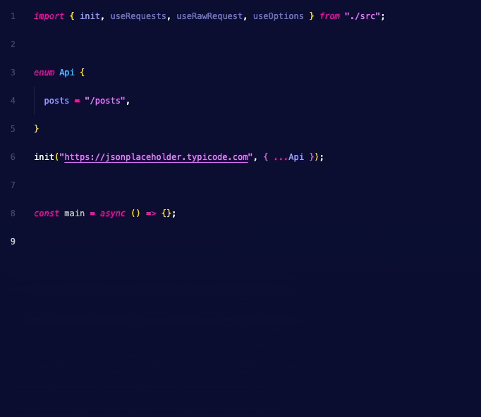
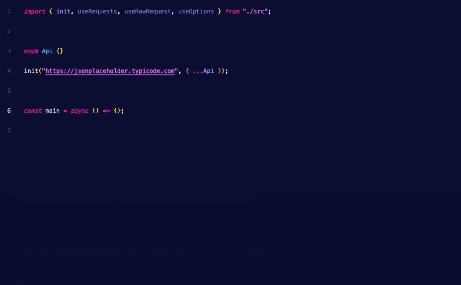

<div align="center">
	<br>
	<br>
	
	<br>
	<br>
	<br>
	<br>
</div>

**Support questions should be asked [here](https://github.com/frangeris/use-requests/discussions).**

> Type-Safe HTTP client hook helper to handle requests based on native fetch api with some magic under the hood ✨.


## Install

> [!CAUTION]
> This package is still in development and not ready for production use.

```sh
npm install use-requests
```

## Get started

This module provides a lightweight abstraction for making API requests in TypeScript, with a focus on defining and using REST API endpoints efficiently. The module offers a clean, type-safe way to handle HTTP requests using predefined endpoints.

Some key features:

- ✨ Type-safe API endpoint handling.
- ⚡️ Easy initialization with API base URL and endpoints.
- 🦾 Simplified request logic with _GET_, _POST_, and other HTTP methods via [fetch](https://developer.mozilla.org/en-US/docs/Web/API/Fetch_API/Using_Fetch) API.

## Usage

To begin using the API request module, you need to initialize it by specifying the base URL of your API and defining the endpoints you'll be working with (there is an option for `raw` request we will cover later). This setup ensures that all subsequent API requests are made to the correct URLs with consistent endpoint handling.

First, you’ll need to import the necessary functions.

- The `useRequests` function is the core hook for making requests.
- While `init` setup the configuration for your API requests and can be called from anywhere in your app.

Here's how you import them from the module:

```ts
import { init, useRequests, useOptions, useRawRequests } from "use-requests";
```

Then, you'll define your API endpoints using an [enum](https://www.typescriptlang.org/docs/handbook/enums.html). This `enum` acts as a centralized way to declare all the routes your API supports. It also helps ensure that requests are type-safe, meaning you'll get compile-time checks for correct usage:

```ts
export enum Api {
  users = "/users",
  userById = "/users/:id",
}
```

Each key in the enum represents a different API route. These routes can contain dynamic parameters (e.g., `:id`), which are replaced by actual values when making requests.

Now, we need to initialize by using the `init` function. This function requires two arguments:

- **Base URL**: The root URL where your API is hosted (`e.g. https://api.example.io/dev`).
- **Endpoints**: The enum you defined earlier, which specifies your available API routes.

```ts
init("https://api.example.io/dev", { endpoints: Api });
```

In above example:

- `https://api.example.io/dev` is the base URL of the API.
- Passing the enum as value for `endpoints` config option ensures that all the endpoints defined in the `Api` enum are passed to the initialization function.

By setting up this initialization, you ensure that every request you make using the `useRequests` hook will automatically target the correct API with the predefined endpoints.

The [fetch options](https://developer.mozilla.org/en-US/docs/Web/API/Window/fetch#options) to customize the request are also supported via the second argument of the `init` function, eg:

```ts
init("https://api.example.io/dev", {
  endpoints: Api,
  options: {
    cache: "no-store",
    credentials: "include",
    keepalive: true,
    // ...
  }
```

Other available global options can be set via the `useOptions` hook, we will cover this later.

### Escape path parameters

In the `Api` enum, you can define dynamic path parameters by prefixing them with a colon (`:`). For example, the `userById` endpoint has a dynamic `:id` parameter, which can be replaced with an actual value when making requests.

But what if you need to use a literal colon in your path, such as `/users:top`? You can escape the colon by _escaping it_ with a double backslash `\\`, like this:

```ts
topMessagesByUser = `/users/:id/messages\\:top`,
// will hit /users/1/messages:top
```

This way, the colon will be treated as a literal character in the path, rather than a dynamic parameter.

### ⚡️ Now, let's make some requests

Once the module is initialized, you can easily make requests to the defined endpoints. Here's quick snippet:

```ts
import { init, useRequests, useOptions } from "use-requests";

type User = {};

export enum Api {
  users = "/users",
  userById = "/users/:id",
}

init("https://api.example.io/dev", { endpoints: Api });

const main = async () => {
  const { userById } = useRequests<typeof Api>();

  // the returned structure is the same as the fetch Response object
  // so json, ok, body, blob, bytes, headers, status, text, statusText are available
  const t = await userById.get<User>({ params: { id: 1 } });
};
main();
```

> [!NOTE]
> The `data` property is also available, but there are some caveats we will discuss later.

All HTTP methods expect an optional `RequestPath` object, which can be used to customize the request path, query strings, and other options. For example:

Adding another part to the URL, used for extends the endpoint:

```ts
const { users } = useRequests<typeof Api>();
await users.get({ path: "/test", query: { id: "1" } });
// will request to https://api.example.io/dev/users/test?id=1
```

---

Based on the above example, the `useRequests` hook returns an object with methods for each endpoint defined in the `Api` enum. You can then call these methods to make requests to the corresponding API routes.

### Only registered endpoints are available

If you try to access an endpoint that isn't defined in the `Api` enum, TypeScript will throw a compile-time error. This ensures that you only use the correct endpoints and helps prevent runtime errors.



### Type-safe request handling

The `useRequests` hook provides methods for each endpoint defined in the `Api` enum. These methods are type-safe, meaning that the parameters you pass to them are checked against the expected types defined in the `Api` enum. This ensures that you're using the correct parameters for each endpoint and helps prevent runtime errors.



The response by any methods is an instance of [fetch Response](https://developer.mozilla.org/en-US/docs/Web/API/Response) object, which you can use to extract `status, headers, json(), text()`, etc.

> [!WARNING]
> Any parameters defined in the endpoint definition are required when calling the method. If you omit a required parameter, TypeScript will throw a compile-time error or an exception will be thrown at runtime.

### `data` property

The `data` property is a helper that allows you to extract the JSON response from the fetch response object, it's a wrapper that _in case that **data** property exists_ in the `json` response so will be casted to the generic type used, eg: `User[]` or `User`.

#### Caveats

1. The property is not populated automatically, you need to call it explicitly in a asynchronous way.
2. `data` key needs to be present on the response, otherwise, it will return `null`,

Here's an example of how to use the `data` property, given the following JSON response for `GET /users`:

```json
{
  "data": [
    {
      "id": 1,
      "name": "John Doe"
    }
  ]
}
```

```ts
const { users } = useRequests<typeof Api>();
const { data } = await users.get<User[]>();
console.log(await data); // [{ id: 1, name: "John Doe" }]
```

The `await` keyword is used to extract the JSON response from the fetch response object and cast it to the generic type `User[]` in runtime, so it will be available only when requested, otherwise and others scenarios when needs the direct manipulation of the response object, you can use the fetch response object directly.

### Raw requests

In some cases, you may need to make requests that don't correspond to any of the predefined endpoints. For these cases, you can use the `useRawRequests` hook, which provides a way to make raw requests to any URL.

The `useRawRequests` hook returns an object with methods for making requests using the `fetch` API. You can use these methods to make requests to any URL, with full control over the request path, query strings, headers, and other options.

When using raw requests, global shared options are not applied, here's an example of how to use the `useRawRequests` hook:

```ts
const raw = useRawRequests();
const r = await raw("https://myapi.io").get();
// GET https://myapi.io
```

### Headers

There is a way to customize headers for all requests, you can use the `useOptions` hook to set headers, options, and other configurations for all requests.

The `useOptions` function allows you to customize options, including headers following the standard [Headers](https://developer.mozilla.org/en-US/docs/Web/API/Headers) API specification.

All headers are shared across all requests, so you only need to set them once. For example, you can set an authorization token for all requests and will be used for all subsequent requests, eg:

To use `useOptions`, you first need to import it from the module:

```ts
import { useOptions } from "use-requests";

const { headers } = useOptions();
const { users } = useRequests<typeof Api>();
headers.set("Authorization", "Bearer token");
// ...
const t = await users.get<User[]>();
```

This sets the `Authorization` header for all requests made using the `useRequests` hook.

> [!NOTE]
> All request from now on will use this header while the instance is alive

By using `useOptions`, you can easily customize headers and other request options (future) on a per-request basis, providing flexibility and control over your API interactions.

## Why `use-requests`?

In modern web development, working with APIs is a common requirement, but it often comes with challenges such as:

- Boilerplate code: Repeating the same request logic for every API call.
- Hard-coded endpoints: Scattering API URLs and endpoints throughout your code, making it difficult to maintain and prone to errors.
- Lack of type safety: Incorrect or inconsistent endpoint usage often isn't caught until runtime, leading to more bugs and harder debugging.
- Manual query and param handling: When working with REST APIs, you often need to manage dynamic path parameters (`:id`, `:userId`, etc.) and query strings (`?id=1`) manually.

This module addresses these challenges by offering a _Type safety for API requests_ following strict typing for your endpoints, ensuring that the routes, parameters, and query strings are used correctly at compile-time.

By using an enum to define all endpoints in one place, it becomes easier to update, maintain, and reuse API routes without worrying about inconsistent URL usage across your codebase.

Making request handling via the `useRequests` hook abstracts away much of the boilerplate required for making HTTP requests, allowing you to focus on the logic of your application instead of the details of constructing API calls.

As your API grows, you can simply add more routes to the Endpoints enum and have them immediately available across your project without rewriting any request logic.

Made with ❤️ by [frang](https://github.com/frangeris)
